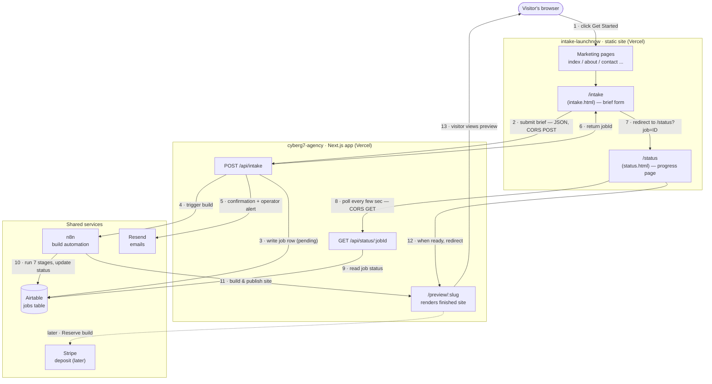
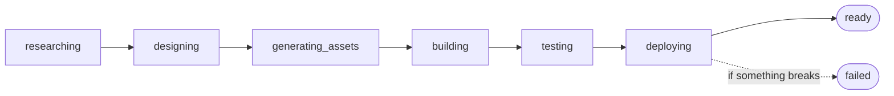

# LaunchNow Intake Funnel — Architecture (one page)

Plain-language map of how the funnel works. **Two Vercel projects** talk to each other over the web,
**Airtable** is the shared job log, and **n8n** runs the build.

---

## The flow

### The 13 steps in words
1. Visitor clicks **Get Started** on the static site.
2. The `/intake` form sends the brief to the engine (JSON over HTTPS; allowed by **CORS**).
3. The engine writes a **job row** (status `pending`) to **Airtable**.
4. The engine tells **n8n** to start building.
5. The engine emails the visitor (confirmation) + the operator (alert) via **Resend**.
6. The engine replies with a random **job ID** (UUID — unguessable).
7. The form redirects the visitor to **`/status?job=<id>`**.
8. The `/status` page **polls** the engine every few seconds (CORS GET) — backs off, pauses on hidden tabs, gives up after 15 min.
9. The engine reads that job's **current status from Airtable**.
10. n8n runs the **7 build stages**, updating the Airtable row as each finishes.
11. n8n **builds & publishes** the finished site (served by the engine at `/preview/:slug`).
12. When status = `ready`, the `/status` page **redirects** the visitor to the preview.
13. The visitor views their generated **preview site** (`<slug>-preview.cyberg7.com.sg`).

> Payment is **later**: a "Reserve this build" button on the preview starts the **Stripe** deposit. Not part of the funnel repo.

---

## The 7 build stages (what n8n runs)

In plain terms: study the business + competitors → pick a design → write the words & pick images →
assemble the pages → check it → publish it → **done**. Airtable shows which stage it's on; `/status` reads that.

---

## The automation — n8n "Factory Orchestrator" workflow

The 7 stages above are run by **one n8n workflow** — *CyberG7 Factory Orchestrator* (ID `eVFIEBpA1J9lIMGC`).
It's the conductor: it calls the engine's `/api/orchestrator/<stage>` endpoints in order, and **between** the
mechanical stages it runs **5 Claude Sonnet 4.6 agents** that read the job from Airtable, think in a fixed JSON
shape, and write the result back. 35 nodes; one straight line of 25 steps + 10 attached model/schema helpers.

```mermaid
flowchart TD
    WH(["Webhook — POST trigger (from /api/intake)"]) --> R202["Respond 202<br/>(accepted, runs in background)"]
    R202 --> RES["POST /research"]
    RES --> ENR["POST /enrich-research"]
    ENR --> g1

    subgraph AG1["AI agent · Research analyst"]
      direction LR
      g1["Get job (Airtable)"] --> a1["Claude Sonnet 4.6<br/>+ researchAnalysis schema"] --> w1["Write researchAnalysis"]
    end
    w1 --> DES["POST /design"]
    DES --> g2

    subgraph AG2["AI agent · Design strategist"]
      direction LR
      g2["Get job"] --> a2["Claude Sonnet 4.6<br/>+ themeTokens schema"] --> w2["Write themeTokens"]
    end
    w2 --> g3

    subgraph AG3["AI agent · Copywriter"]
      direction LR
      g3["Get job"] --> a3["Claude Sonnet 4.6<br/>+ copyDraft schema"] --> w3["Write copyDraft"]
    end
    w3 --> g4

    subgraph AG4["AI agent · Component selector"]
      direction LR
      g4["Get job"] --> a4["Claude Sonnet 4.6<br/>+ componentChoices schema"] --> w4["Write componentChoices"]
    end
    w4 --> g5

    subgraph AG5["AI agent · Asset-query selector"]
      direction LR
      g5["Get job"] --> a5["Claude Sonnet 4.6<br/>+ assetQueries schema"] --> w5["Write assetQueries"]
    end
    w5 --> GA["POST /generate-assets"]
    GA --> BLD["POST /build"]
    BLD --> TST["POST /test"]
    TST --> DEP["POST /deploy"]
    DEP --> FIN["POST /finalize<br/>(status = ready + previewUrl)"]
    FIN --> DONE(["Preview live:<br/>slug-preview.cyberg7.com.sg"])
```

**Two kinds of node, repeated:**
- **`POST /…`** — n8n calls the engine's stage endpoint (does the work + updates the job's status in Airtable). Protected by a secret header (`ORCHESTRATOR_SECRET`).
- **AI agent trio** — `Get job (Airtable)` → `Claude Sonnet 4.6 + <schema>` → `Write <result>`. The schema forces valid JSON.

**The 5 AI agents (what each writes onto the job):**
| Agent | Produces | Plain meaning |
|---|---|---|
| Research analyst | `researchAnalysis` | positioning, audience, angles |
| Design strategist | `themeTokens` | colours, fonts, spacing |
| Copywriter | `copyDraft` | headlines, section text, CTAs |
| Component selector | `componentChoices` | which page sections to use |
| Asset-query selector | `assetQueries` | what images to fetch |

**Trigger:** the backend's `/api/intake` POSTs to this workflow's **webhook** (stored as the secret
`N8N_FACTORY_WEBHOOK_URL`). ⚠️ The webhook is **unauthenticated** — anyone who learns the URL can start a real
(paid) build. That's the abuse vector behind the Turnstile recommendation.

---

## Tech stack

| Part | Tech |
|---|---|
| **Front counter** — `intake-launchnow` (the funnel) | HTML, CSS, plain JavaScript (no framework, no build) · Google Fonts · Google tag (gtag) · **Vercel** hosting · GitHub |
| **Kitchen** — `cyberg7-agency` / `website-factory` (the engine) | **Next.js** + **React** + **TypeScript** · **Tailwind CSS** · **Zod** (validation) · **Airtable** (job database) · **n8n** (build automation) · **Anthropic Claude** (Sonnet 4.6 — the AI agents inside n8n) · **Stripe** (deposit) · **Resend** (email) · **Clerk** (optional login) · **Vercel** hosting · GitHub |
| **Glue between them** | JSON over HTTPS · **CORS** (permission to call across sites) · **UUID** job IDs · **wildcard DNS** (`*-preview.cyberg7.com.sg`) for the preview sites |

---

## Where everything lives

| Thing | Where |
|---|---|
| Funnel site (live) | `intake-launchnow.cyberg7.com.sg` — Vercel project `cyberg7/intake-launchnow`, repo `Cyberg7tech/intake-launchnow`, branch `main` |
| Funnel docs + history | repo `Cyberg7tech/intake-launchnow`, branch `claude/busy-curie-pjEii` (`PLAN.md`, `PLAN-REVIEW-LOG.md`, `handoff.md`, this file) |
| Engine + API + previews | `agency.cyberg7.com.sg` + `<slug>-preview.cyberg7.com.sg` — Vercel project `cyberg7-agency`, repo `Cyberg7tech/website-factory`, branch `main` |
| Job database | Airtable `jobs` table (read/written only by the engine) |
| Build automation | n8n (triggered by the engine's `/api/intake`) |

---

## The Airtable "jobs" table (the shared logbook)
One row per submission, roughly these columns:
- **jobId** (ticket number) · **slug** (site name)
- **the brief**: brand, email, industry, goal, audience, competitor URLs, optional look/colours
- **status / current stage** (`pending → researching → … → ready / failed`)
- **submitted time**, **started time**
- **previewUrl** (filled in when the site is built) · **failureReason** (only if it breaks)

The engine **writes** the row at submit and **updates** it as n8n works; the `/status` page **reads** it (via the engine) to show progress. That one table keeps both sides in sync.
